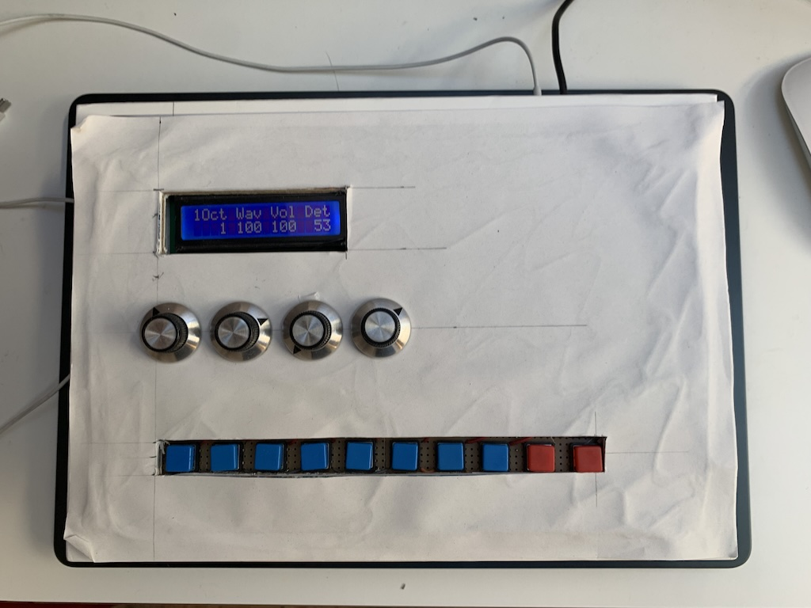
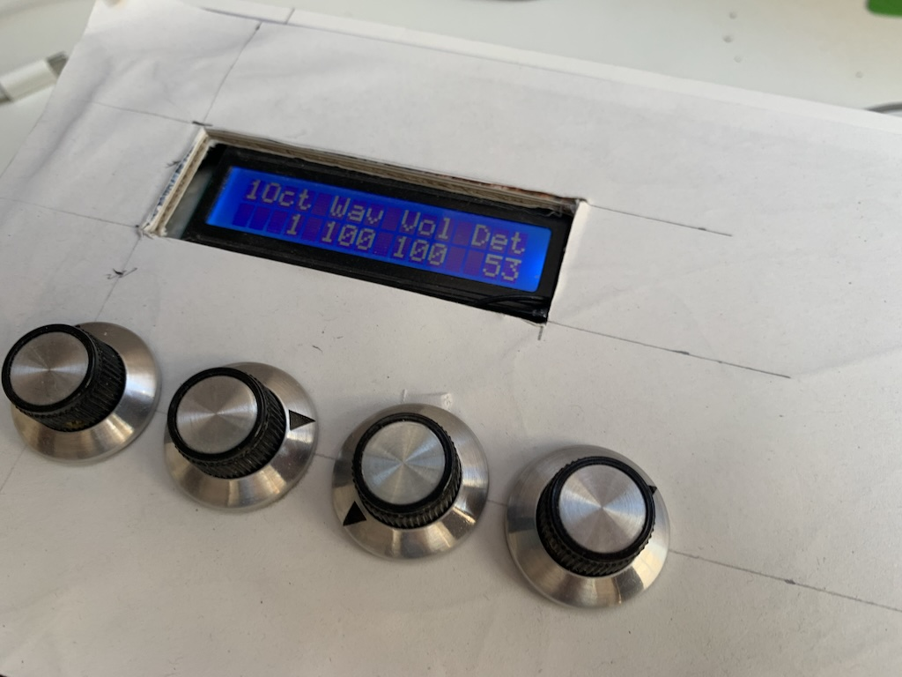
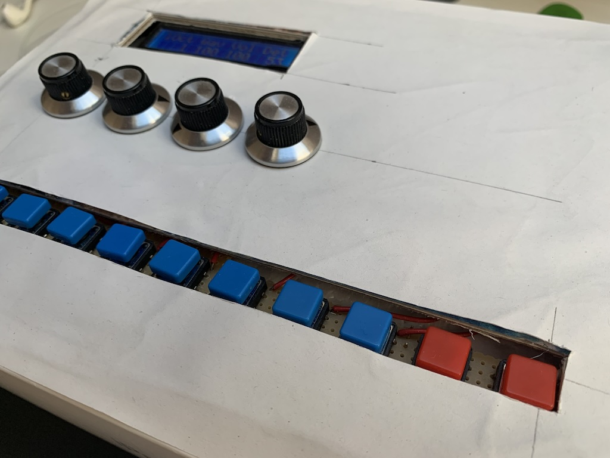

# Reduc-6: POC lowcost 'groovebox' device

Source code and hardware specs of a proof-of-concept minimal standalone sound machine.

Originally designed as a minimal low-cost hardware device, but can also be built for desktop or iOS (plugin, or standalone app).

The goal is to explore minimal hardware UI for sound creation, as a sandbox with contrained interaction surface yet infinite possibilities.

## Features

- self contained sound machine using Teensy microcontroller
- 6 voice modular sound engine, multitimbral or polyphonic mode (or mixed)
- Two types of voices: VA synth, or percussion oriented
- 6 sequencer tracks, up to 64 steps (configurable per track for polymetric sequences)
- All sound parameters can be parameter locked per step
- Some global or per-track effects (delay, bit reduction, sample rate reduction, overdrive, stutter/beat-repeat)
- Per track probability
- USB Midi and USB Audio out, Stereo or 8-track (Stereo mix and 6 individual tracks, for integration into DAW setup)
- Simple UI with 5 modes: Synth, Sequencer, Part config, Mixer, Keyboard

## Hardware

- teensy 4.1
- Teensy Audio board
- 10 Tactile switches
- 4 Potentiometers
- 16x2 lcd display

## Building the software

TBD: PlatformIO build scripts is work-in-progress. Can also be built using Arduino IDE, with teensyduino installed. 

## Desktop / iOS build

Alternative builds as AU plugin were added to facilitate seamless integration into a DAW, 
and as a tool during development, for debugging, benchmarking and faster development iterations. They are based on the iPlug2 framework.
The sound engine is platform-independent
The hardware abstraction layer encompasses display, knobs and buttons, audio interface, midi interface, and system functionality such as logging, timers etc.

The iPlug2 UI was on purpose kept minimal and identical to the interface on the teensy. Of course, UI improvements and advanced features would be low hanging fruits 
(e.g. better browser for stored projects and patches, real-time audio waveform display, graphical display, recording of audio performances)

### Build instructions

Building the code using the xcode project should be relatively straightforward on MacOS. It relies on a checkout of iPlug2. Currently, we use the version from May 2025

## Project status

Proof-of-concept with working prototypes.

